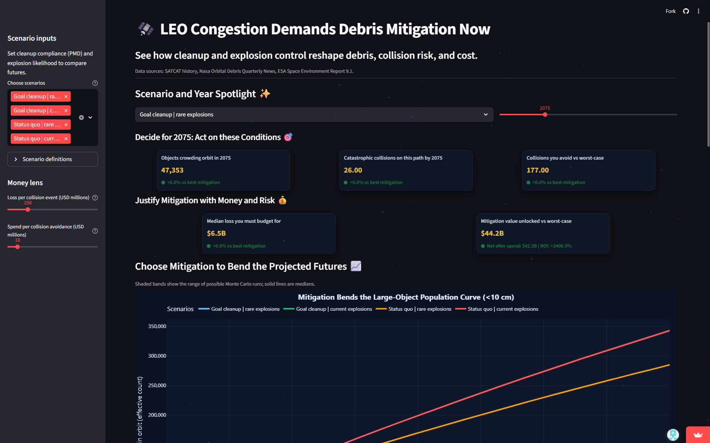
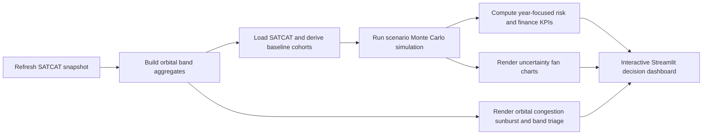

# Orbital Debris Forecasting and Mitigation Dashboard

End-to-end data science dashboard for forecasting orbital-object congestion and cumulative collision risk under mitigation versus status-quo policy scenarios.

[](#environment)
[](#live-dashboard-and-screenshot)
[](#modeling-and-scenario-design)
[](#modeling-and-scenario-design)
[](#scenario-matrix)

## Table of Contents
- [Executive Summary](#executive-summary)
- [Project Objective](#project-objective)
- [Live Dashboard and Screenshot](#live-dashboard-and-screenshot)
- [Quick Start](#quick-start)
- [Key Files Index](#key-files-index)
- [Data Sources](#data-sources)
- [Data Scope and Scale](#data-scope-and-scale)
- [End-to-End Pipeline](#end-to-end-pipeline)
- [Repository Workflow](#repository-workflow)
- [Dashboard Experience](#dashboard-experience)
- [Modeling and Scenario Design](#modeling-and-scenario-design)
- [Scenario Matrix](#scenario-matrix)
- [Economic Lens](#economic-lens)
- [Outputs and Artifact Layout](#outputs-and-artifact-layout)
- [Testing](#testing)
- [Environment](#environment)
- [Practical Limitations](#practical-limitations)
- [Next Planned Extensions](#next-planned-extensions)
- [License](#license)

## Executive Summary
This project builds a professional Streamlit decision dashboard to answer a concrete policy question:

How much do stronger debris mitigation controls reduce long-run orbital congestion, cumulative catastrophic collisions, and expected financial loss.

### Portfolio Snapshot
| Dimension | Summary |
|---|---|
| Decision focus | Prioritize mitigation policies and orbital bands before cascade risk compounds |
| Historical data window | `1957-10-04` to `2025-11-21` launch records in `Data/satcat.csv` |
| Input scale | 66,420 SATCAT rows raw, 65,988 Earth-centered rows after orbit-center filtering |
| Forecast setup | 4 scenarios, 300 Monte Carlo paths each, 200-year projection window |
| Core outputs | Scenario KPIs, risk/cost cards, uncertainty fan charts, orbital-band congestion triage |

### Key Outcomes
- Converts raw SATCAT records into policy-facing risk and cost narratives in a single dashboard
- Compares mitigation and status-quo futures with synchronized scenario and year controls
- Surfaces where congestion is concentrated by orbital band and debris composition
- Frames technical simulation results as actionable governance and investment decisions

### Why This Matters
- LEO congestion can compound into persistent collision cascades if launch hygiene and disposal compliance remain weak
- Infrastructure-heavy bands require targeted intervention, not broad generic messaging
- Policymakers and operators need quantitative cost-of-inaction views, not only charts of object counts

## Project Objective
Build a reproducible forecasting workflow and dashboard that helps answer:

- How large-object congestion evolves over long horizons under different mitigation assumptions
- How catastrophic collision accumulation changes with post-mission disposal compliance and explosion rates
- Which orbital bands should be prioritized first for cleanup, traffic discipline, and monitoring
- How much expected loss can be avoided, and whether mitigation spend is financially justified

This repository emphasizes reproducibility, transparent assumptions, and decision-grade communication.

## Live Dashboard and Screenshot
Live app:

- https://satellite-debris-forecasting.streamlit.app/

If the hosted instance sleeps due to Streamlit resource limits, run locally with the quick-start commands below or contact me to bring the dashboard back online.



## Quick Start
### Full Rebuild (Refresh SATCAT + rebuild orbital inputs + launch dashboard)

```bash
python -m venv .venv
.venv\Scripts\activate
pip install -r requirements.txt
python update_sats.py
python build_shell_counts.py
streamlit run build_dashboard.py
```

### Dashboard-Only Run (using existing local data files)

```bash
python -m venv .venv
.venv\Scripts\activate
pip install -r requirements.txt
streamlit run build_dashboard.py
```

## Key Files Index
| File | Role | Main Inputs | Main Outputs |
|---|---|---|---|
| `update_sats.py` | Refreshes local SATCAT snapshot from CelesTrak | CelesTrak SATCAT CSV endpoint | `Data/satcat.csv` |
| `build_shell_counts.py` | Builds orbital-band aggregates for ring/sunburst analysis | `Data/satcat.csv` | `Data/orbital_shell_counts_wide.csv`, `Data/orbital_shell_counts_long.csv`, `Data/orbital_shell_summary.csv` |
| `build_dashboard.py` | Main Streamlit app: simulation, KPIs, charts, styling | SATCAT + orbital band CSVs | Live interactive dashboard |
| `dashboard_helpers.py` | Shared helpers for percentiles, deltas, formatting | Scenario path arrays | KPI-ready summaries and formatted strings |
| `test_dashboard_helpers.py` | Unit tests for helper correctness | `dashboard_helpers.py` | Regression-safe utility checks |
| `create_orbitals.py` | Optional static concentric-ring visual generator | `Data/orbital_shell_counts_long.csv` | Export-ready static ring figure (manual save lines) |
| `.streamlit/config.toml` | Streamlit theme configuration | N/A | App-level theme defaults |
| `Data/dashboard_demo.png` | Portfolio screenshot for README/demo | Streamlit app output capture | README visual preview |

## Data Sources
- CelesTrak SATCAT public catalog CSV:
  - `https://celestrak.org/pub/satcat.csv`
- NASA Orbital Debris Quarterly News reference snapshot:
  - `Docs/ODQN 29-3_final.pdf`
- ESA Space Environment Report reference snapshot:
  - `Docs/Space_Environment_Report_I9R1_20251021.pdf`

## Data Scope and Scale
Current local snapshot characteristics in this repository:

- Raw SATCAT rows: **66,420**
- Earth-centered orbit rows (`ORBIT_CENTER == "EA"`): **65,988**
- Latest launch date in snapshot: **2025-11-21**
- Baseline year used by dashboard simulation: **2025**
- Active objects at baseline cut (`2025-01-01`): **29,633**
- Modeled parent classes at baseline (`SC + RB + SOZ`): **16,258**

### Orbital Band Composition (from `Data/orbital_shell_summary.csv`)
| Band | Total Objects | Debris Share |
|---|---:|---:|
| LEO 0-400 km | 1,106 | 2.7% |
| LEO 400-700 km | 12,445 | 12.1% |
| LEO 700-1200 km | 9,433 | 75.8% |
| MEO 1200-19000 km | 5,022 | 61.4% |
| GNSS 19000-23000 km | 1,250 | 46.5% |
| High incl GEO 23000+ km | 2,095 | 10.5% |

## End-to-End Pipeline


## Repository Workflow
### 1) Refresh raw satellite catalog
Script: `update_sats.py`

- Pulls latest SATCAT CSV snapshot from CelesTrak
- Writes to `Data/satcat.csv`

Run:

```bash
python update_sats.py
```

### 2) Build orbital shell/band inputs
Script: `build_shell_counts.py`

- Filters to Earth-centered orbital records and modeled object types
- Computes semimajor-axis altitude from apogee/perigee or period fallback
- Buckets objects into configured altitude bands
- Exports wide, long, and summary CSVs used by dashboard visuals

Run:

```bash
python build_shell_counts.py
```

### 3) Launch interactive forecasting dashboard
Script: `build_dashboard.py`

- Loads SATCAT cohort state and orbital-band aggregates
- Runs and caches scenario Monte Carlo fans
- Renders policy KPIs, cost cards, fan charts, and orbital-band triage views

Run:

```bash
streamlit run build_dashboard.py
```

### 4) Optional static orbital chart export
Script: `create_orbitals.py`

- Builds a static concentric ring chart from long-form orbital counts
- Save calls are intentionally commented for manual enablement

Run:

```bash
python create_orbitals.py
```

## Dashboard Experience
The app is designed as a policy decision surface rather than a passive chart gallery.

### Sidebar Controls
- Scenario selector for mitigation versus status-quo cases
- Cost sliders for collision loss assumption and avoidance spend assumption
- In-app scenario definition expander for quick interpretation context

### Decision Surface
- Scenario + year spotlight control synchronizes every KPI and chart to one decision year
- Top KPI row communicates congestion, cumulative collisions, and avoided collisions
- Financial row translates risk deltas into expected loss, mitigation value, net benefit, and ROI framing

### Visual Analytics Panels
- Fan chart: projected effective large-object population over 200 years with uncertainty bands
- Fan chart: cumulative catastrophic collisions over 200 years with uncertainty bands
- Orbital sunburst: debris versus satellites composition by altitude band
- Band triage cards: infrastructure share, debris share, and congestion rank for selected band
- Focus-versus-extremes stacked bar: selected band compared with most/least crowded bands

## Modeling and Scenario Design
The simulation in `build_dashboard.py` combines cohort aging, explosion hazard, collision hazard, and decay in a Monte Carlo framework.

Core mechanics:

- Parent object classes: `SC` (payloads), `RB` (rocket bodies), `SOZ` (aux motor remnants)
- Baseline cohorts derived from alive objects at the baseline year cut
- Explosion process calibrated to scenario explosion probability target (`P8`)
- Collision process modeled as nonlinear function of effective parent population plus optional fragment uplift
- Fragment generation assumptions:
  - Explosion fragments by class: `SC=120`, `RB=260`, `SOZ=160`
  - Collision fragments per catastrophic event: `500`
- Decay process includes solar-cycle modulation (`11-year` period) via annual decay factor
- PMD mitigation effect removes a fraction of cohort age-25 objects in high-compliance scenarios
- Effective population is normalized to a baseline target (`36,000`) for stable scenario comparability

Uncertainty representation:

- `N_PATHS = 300` Monte Carlo paths per scenario
- `N_YEARS_FWD = 200` projection years
- Dashboard surfaces median (`p50`) and 5th/95th percentile bands (`p05`, `p95`)

## Scenario Matrix
Defined in `build_dashboard.py` under `SCENARIOS`:

| Scenario ID | PMD Compliance | Explosion Probability (`P8`) | Dashboard Label |
|---|---:|---:|---|
| `PMD25_Exp0.0010` | 90% | 0.10% | Goal cleanup \| rare explosions |
| `PMD25_Exp0.0045` | 90% | 0.45% | Goal cleanup \| current explosions |
| `NoMit_Exp0.0010` | 20% | 0.10% | Status quo \| rare explosions |
| `NoMit_Exp0.0045` | 20% | 0.45% | Status quo \| current explosions |

These pairs enable direct mitigation-versus-status-quo comparison under matched explosion-rate assumptions.

## Economic Lens
The dashboard translates physical-risk outputs into budget-oriented metrics using user-configurable sliders:

- `Loss per collision event (USD millions)`
- `Spend per collision avoidance (USD millions)`

Derived KPI logic:

- Expected loss = median cumulative collisions at focus year x collision loss assumption
- Mitigation value unlocked = collisions avoided versus worst-case x collision loss assumption
- Avoidance budget = collisions avoided x spend-per-avoidance assumption
- Net benefit = mitigation value unlocked - avoidance budget
- ROI signal = relative lift between value unlocked and spend required

This makes the policy argument explicit: risk reduction and financial tradeoff move together.

## Outputs and Artifact Layout
Repository outputs and inputs used by the dashboard:

```text
Debris-Forecasting/
  Data/
    satcat.csv
    orbital_shell_counts_wide.csv
    orbital_shell_counts_long.csv
    orbital_shell_summary.csv
    dashboard_demo.png
  Docs/
    ODQN 29-3_final.pdf
    Space_Environment_Report_I9R1_20251021.pdf
  build_dashboard.py
  build_shell_counts.py
  update_sats.py
  dashboard_helpers.py
  create_orbitals.py
  test_dashboard_helpers.py
```

## Testing
Run tests before and after modifications to helper logic:

```bash
python -m pytest
```

Current tests cover:

- Year-index selection correctness
- Percentile summary extraction at selected years
- CAGR and percent-delta edge cases
- Formatting behavior for money and percentage labels

## Environment
- Python `3.12+` recommended
- Main dependencies:
  - `streamlit`
  - `plotly`
  - `pandas`
  - `numpy`
  - `matplotlib`
- Full pinned list is in `requirements.txt`

## Practical Limitations
- This is a strategic scenario model, not a conjunction-by-conjunction orbital mechanics simulator
- The model is calibrated for comparative policy insight; absolute collision counts are assumption-sensitive
- Objects below tracking thresholds are not explicitly modeled as independent entities
- Launch inflow is based on recent historical behavior and does not include explicit future manifest forecasts
- Cost metrics are user-defined what-if assumptions, not audited accounting estimates

## Next Planned Extensions
- Add explicit launch-manifest growth scenarios by orbit class and operator segment
- Introduce calibration checks against longer historical debris/collision trend benchmarks
- Add active-removal throughput controls (objects removed per year) as first-class policy levers
- Export one-click scenario briefing artifacts (markdown/PDF) for stakeholder reporting

## License
MIT License. See `LICENSE` for details.
